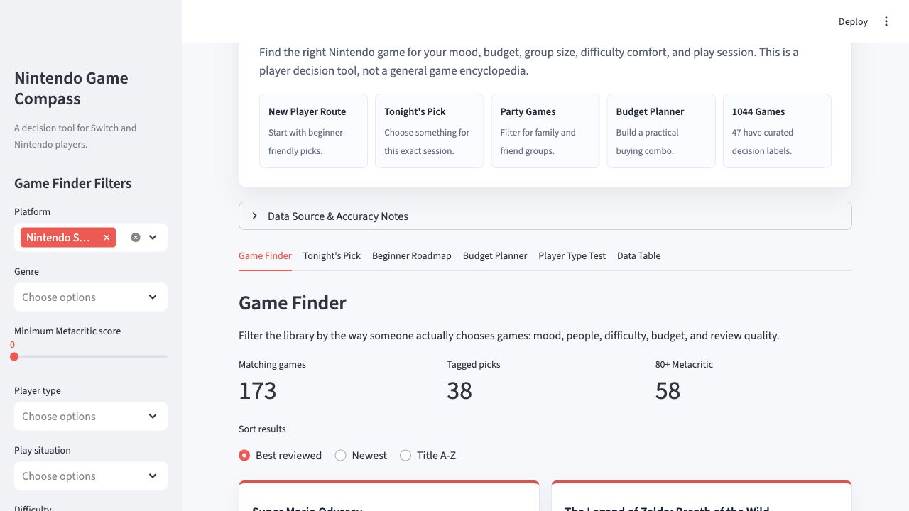
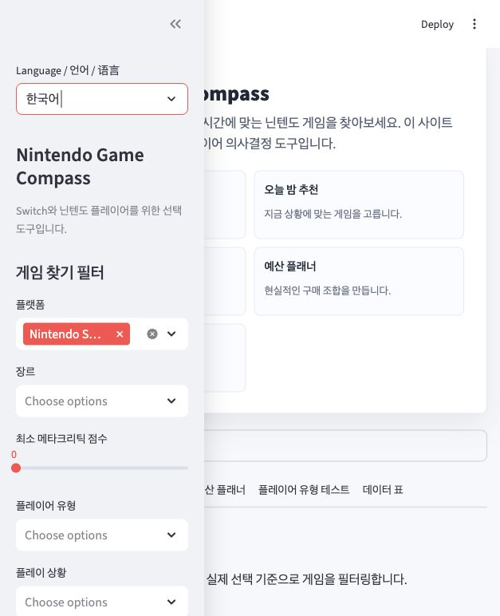

# Nintendo Game Compass


A multilingual Streamlit recommendation site for Nintendo players who are trying to answer a practical question:

**What should I play next, and what actually fits my mood, time, group size, and budget?**

Instead of acting like a general game encyclopedia, Nintendo Game Compass is built as a decision-support experience. It combines curated Nintendo game metadata, multilingual titles, official regional links, and player-oriented tags to help users narrow down a useful choice quickly.



## Overview

Nintendo Game Compass is designed for Switch and Nintendo players who want a cleaner way to choose games.

The current version focuses on four user-facing sections:

- **Game Finder**: a main filtering interface for platform, mood, play situation, player type, difficulty, multiplayer needs, budget, and review score.
- **Beginner Roadmap**: a guided entry path for new players who want a simple starting route.
- **Tonight's Pick**: a quick recommendation flow for choosing a game for the current session.
- **Data Table**: a transparent reference table for the curated dataset, localized titles, and official Nintendo links.

## Product Direction

This project is intentionally positioned as a **curated game guide**, not a massive all-games database.

It separates the system into three layers:

- **Base Metadata**: title, platform, date, genre, developer, and review scores.
- **Curated Decision Labels**: player type, mood, play situation, beginner friendliness, multiplayer fit, and budget tier.
- **Official Presentation Layer**: localized titles, official Nintendo images, and region-specific official game detail pages when verified.

That structure makes the recommendations more transparent and easier to explain than a black-box model.

## Data Sources

Nintendo Game Compass did not start from a blank spreadsheet. The first working version was built from two Kaggle starter datasets, then refined into a curated Nintendo-focused decision tool.

- **Nintendo Games Dataset**  
  Used as the historical Nintendo metadata base for titles, platforms, release dates, genres, developers, ESRB ratings, and review-related fields.
- **Nintendo Switch review / Metacritic-style starter dataset**  
  Used as the recent-era scoring and release cross-check layer for newer Switch-focused titles.

Those starter files were then extended with:

- manually curated recommendation tags
- English, Korean, and Chinese localized titles
- verified official Nintendo regional product links
- cached official Nintendo promotional images

This is why the project is best understood as a **curated recommendation dataset**, not just a raw CSV viewer.

## Key Features

- Multilingual interface in English, Korean, and Chinese
- Official-title-aware search across original, English, Korean, and Chinese game names
- Curated Nintendo game cards with official images
- Region-aware official Nintendo links
- Rule-based recommendations instead of opaque AI scoring
- Beginner-friendly guided route
- Transparent dataset browsing through Streamlit tables

## Preview



## Tech Stack

- **Python**
- **Streamlit**
- **Pandas**
- **NumPy**
- **CSV-based curated datasets**

## Project Structure

```text
nintendo-game-compass/
├── app.py
├── requirements.txt
├── README.md
├── data/
│   ├── game_localizations_manual.csv
│   ├── game_media_manual.csv
│   ├── game_tags_manual.csv
│   ├── media_images/
│   ├── nintendo_games_clean.csv
│   ├── nintendo_games_merged.csv
│   ├── nintendo_games_raw.csv
│   └── recent_switch_games.csv
└── scripts/
    ├── clean_data.py
    ├── fetch_official_media.py
    └── merge_data.py
```

## Run Locally

Install dependencies:

```bash
pip install -r requirements.txt
```

Prepare the dataset:

```bash
python scripts/clean_data.py
python scripts/merge_data.py
python scripts/fetch_official_media.py
python scripts/merge_data.py
```

Run the app:

```bash
streamlit run app.py
```

## Data Pipeline

1. Put the historical source file into `data/nintendo_games_raw.csv`.
2. Add newer Switch and Switch 2 titles into `data/recent_switch_games.csv`.
3. Maintain recommendation tags in `data/game_tags_manual.csv`.
4. Maintain localized game names in `data/game_localizations_manual.csv`.
5. Maintain official media and regional links in `data/game_media_manual.csv`.
6. Run the cleaning, merging, and media scripts to produce `data/nintendo_games_merged.csv`.

## Data Notes

- The project uses a curated Nintendo-focused dataset rather than an exhaustive all-platform catalogue.
- Recent titles are supplemented manually instead of assuming one legacy CSV is enough.
- Player-oriented labels are manually curated for recommendation purposes.
- Localized names are maintained separately from original titles for auditability.
- Official Nintendo images and regional detail links are only included when verified.
- Price guidance in the MVP is categorical, not real-time.

## GitHub Presentation

For a public-facing GitHub repository, this project is best presented as:

- a **finished interactive product**
- a **curated multilingual data project**
- a **recommendation tool with transparent logic**

That means the GitHub landing page should emphasize:

- what the product helps users decide
- what makes the dataset special
- what is manually curated
- what the live public app looks like

This README is already structured for that kind of portfolio-style presentation.

## Public Deployment

The cleanest public option for this project is **Streamlit Community Cloud** connected to a GitHub repository.

Typical setup:

1. Create a new GitHub repository and push this project to it.
2. Sign in to Streamlit Community Cloud.
3. Choose **New app**.
4. Select your GitHub repository, branch, and `app.py`.
5. Deploy the app and share the public URL.

Official deployment docs:

- [Streamlit Community Cloud: Deploy your app](https://docs.streamlit.io/deploy/streamlit-community-cloud/deploy-your-app)

## Future Extensions

- More curated Nintendo-published and third-party Switch titles
- Richer recommendation explanations
- Additional official regional page verification
- Optional API-based metadata expansion later

## Author

**Nintendo Game Compass**  
Curated as a multilingual Nintendo game selection project for player-facing recommendation and public presentation.
